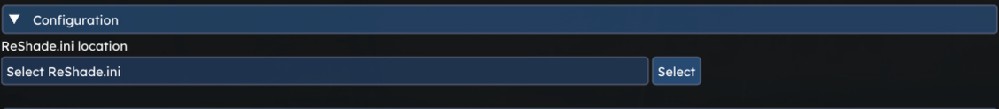
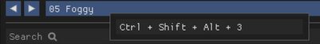
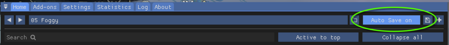
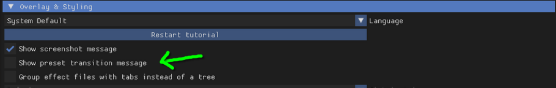
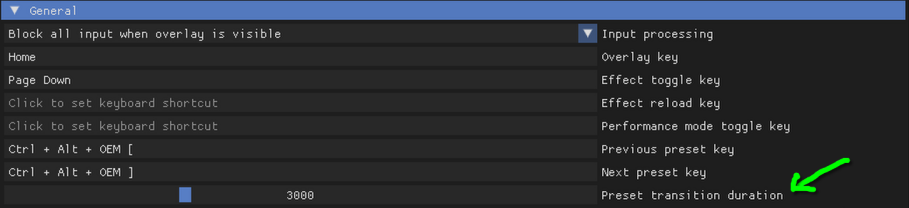
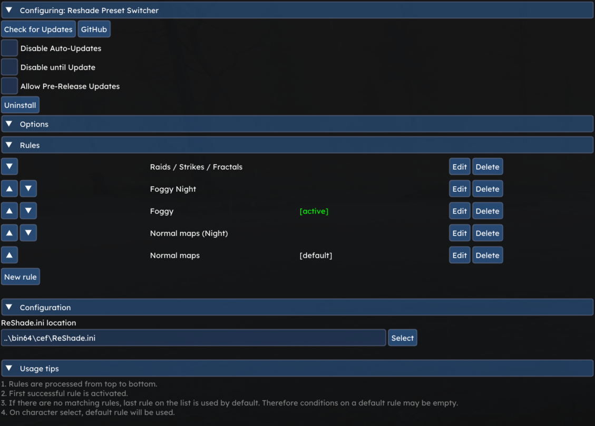
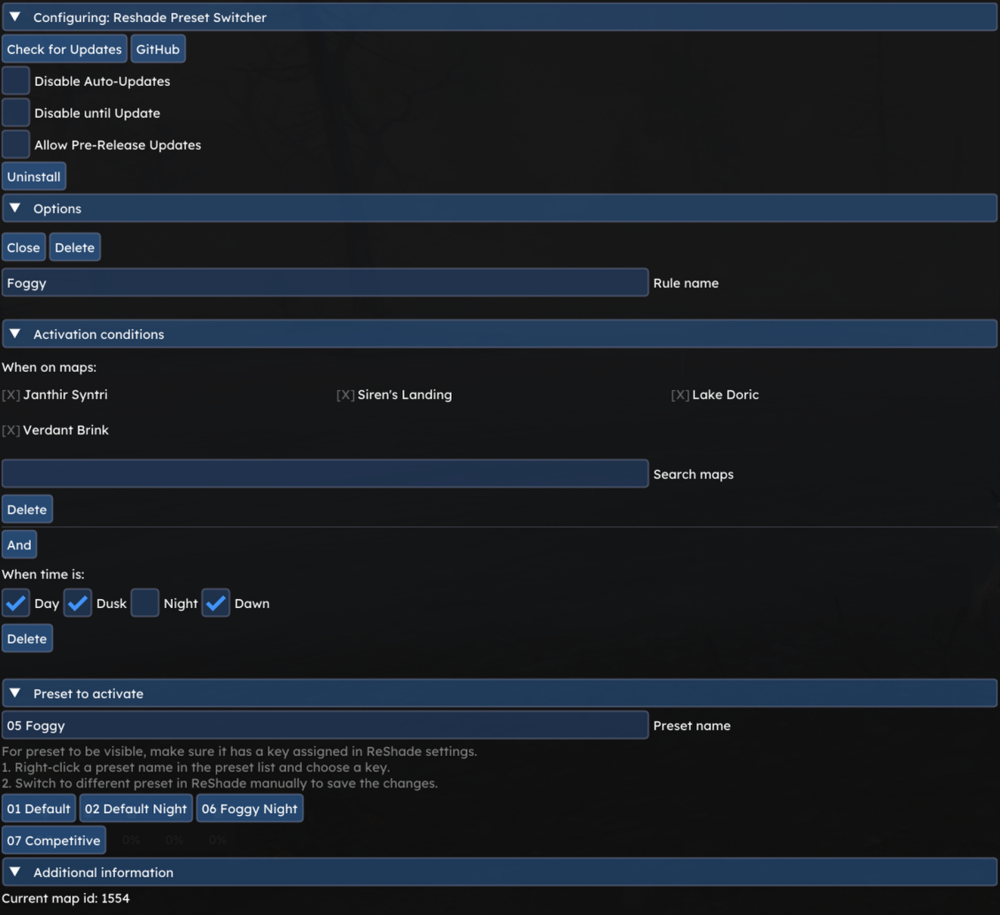

# Reshade Preset Switcher
Reshade Preset Switcher for Nexus.

## Features
- Integrates with Reshade.ini to dynamically switch presets on:
  - map change
  - time change (day, dawn, dusk, night)
- Rule system to define which preset to use under given conditions.

## Disclaimer
This addon uses **macros** (virtual key-presses) to switch reshade presets. However, it does not interact with the game functions and is TOS friendly.
Refer to [macro policy](https://help.guildwars2.com/hc/en-us/articles/360013762153-Policy-Macros-and-Macro-Use) for more details about macro usage.

## Installation
1. Install the [Nexus](https://github.com/RaidcoreGG/Nexus) addon manager ([website](https://raidcore.gg/Nexus)).
2. Download [`reshade_preset_switcher.dll`](../../releases/latest) and place it in your `addons` folder (e.g. `C:\Program Files\Guild Wars 2\addons`).
3. Open the Nexus addon window, click on the refresh button if necessary and load Reshade Preset Switcher.

## Configuration guide
### ReShade.ini
Addon integrates with Reshade.ini to read information about ReShade keybinds and presets.
Choose ReShade.ini in the options to get started:

### Required ReShade configuration
1) Addon will only detect ReShade presets that have keybinds assigned. To assign keybind, open ReShade settings and right-click a preset name:

2) Enable auto-save to make sure ReShade.ini is up to date:

### Optional ReShade configuration tips
For usual gameplay, disable preset transition message in ReShade settings:

Preset transition duration can be configured for smoother preset transitions:

## Screenshots
**Rules and configuration**

**Rule creation / modification**

## Credits
- to https://raidcore.gg/, for developing Nexus,
- to [Zerthox](https://github.com/zerthox), for nexus and mumble rust bindings,
- to https://reshade.me/ for creating a tool.